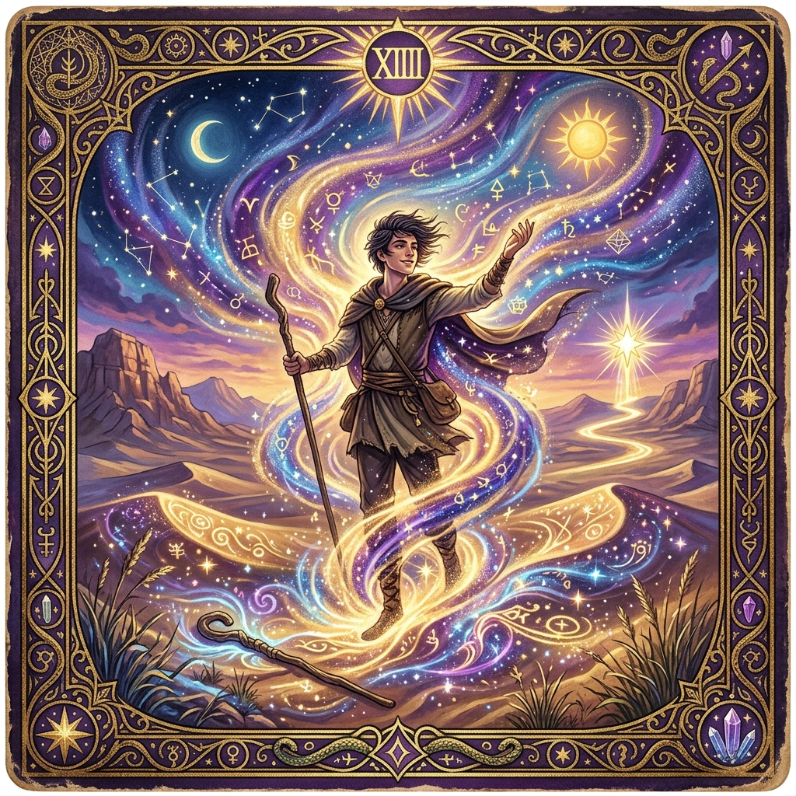
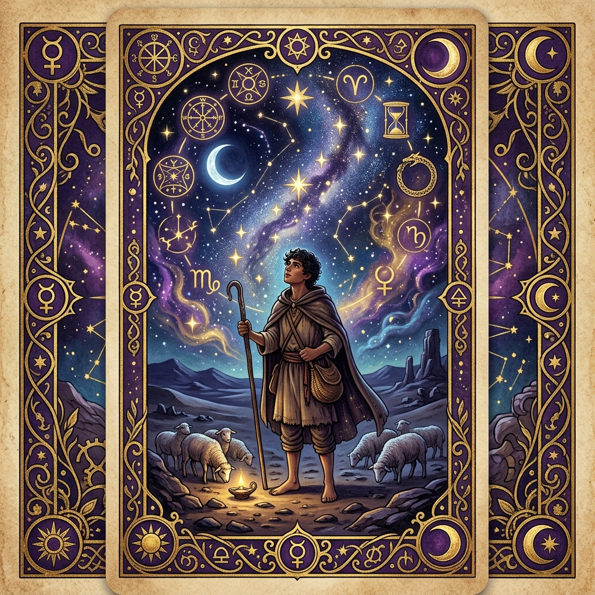
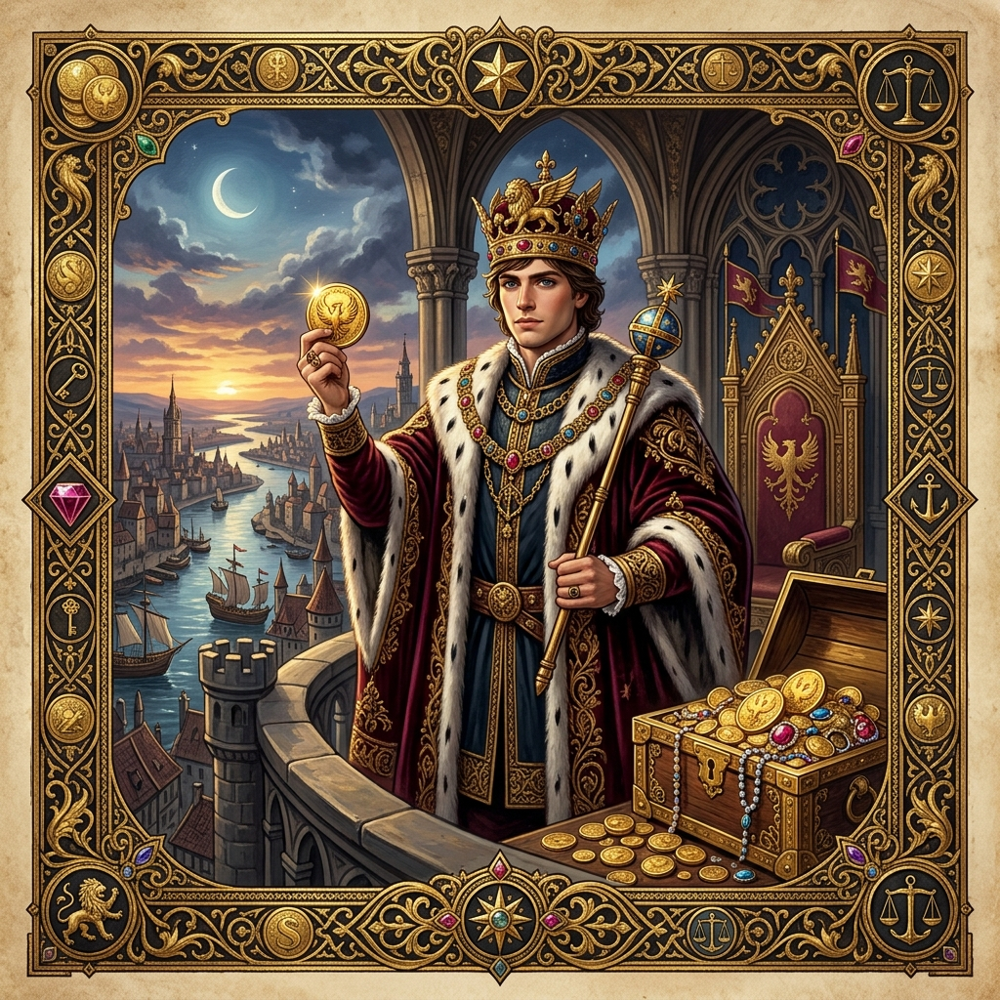
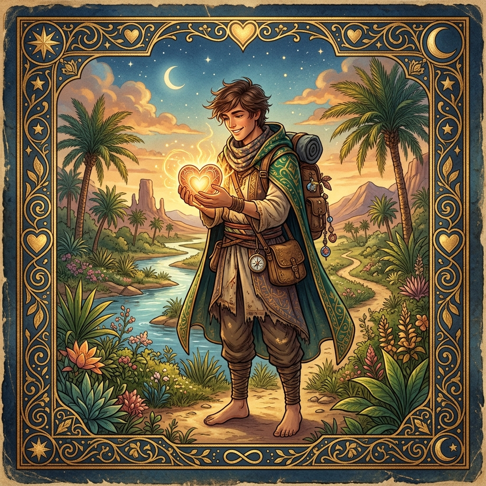
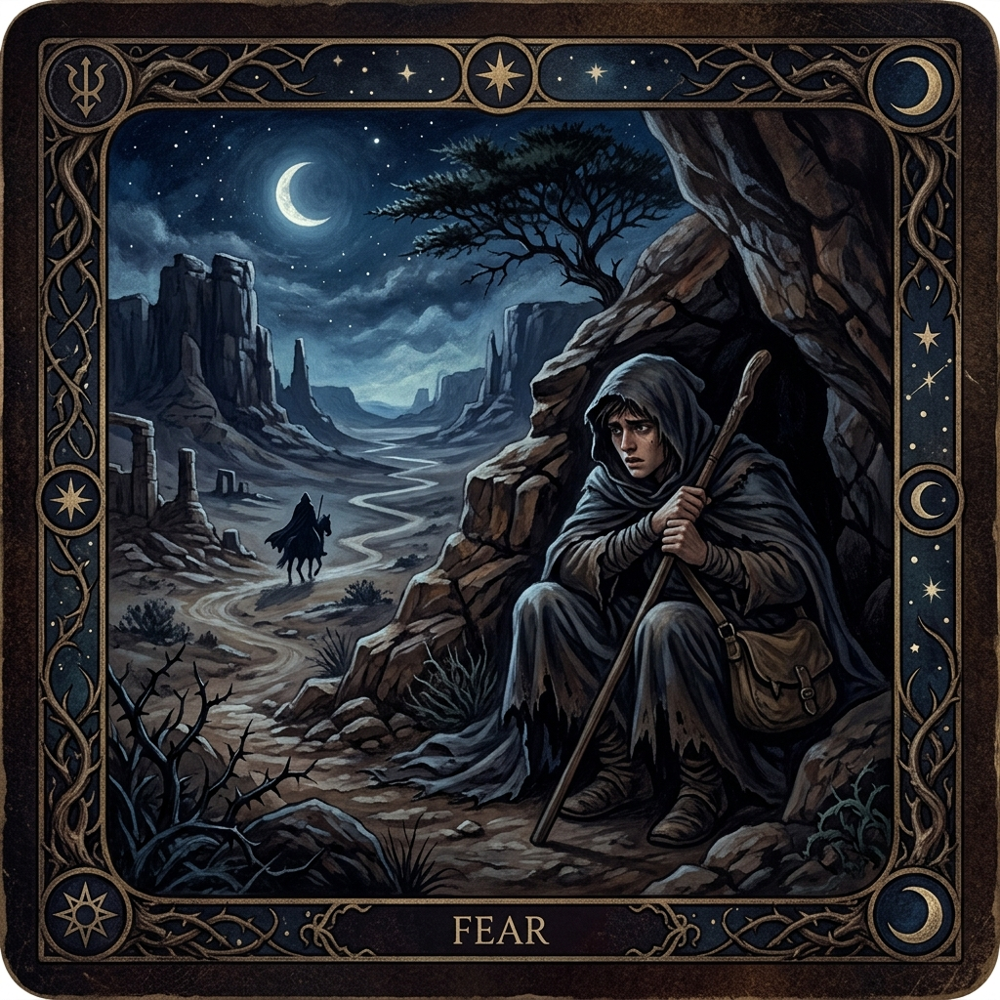
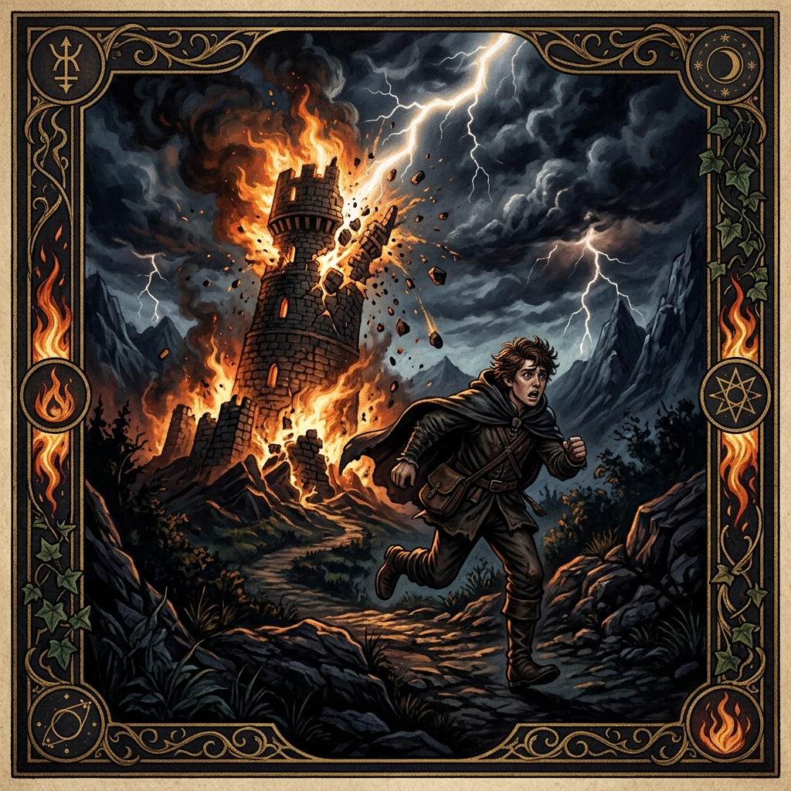
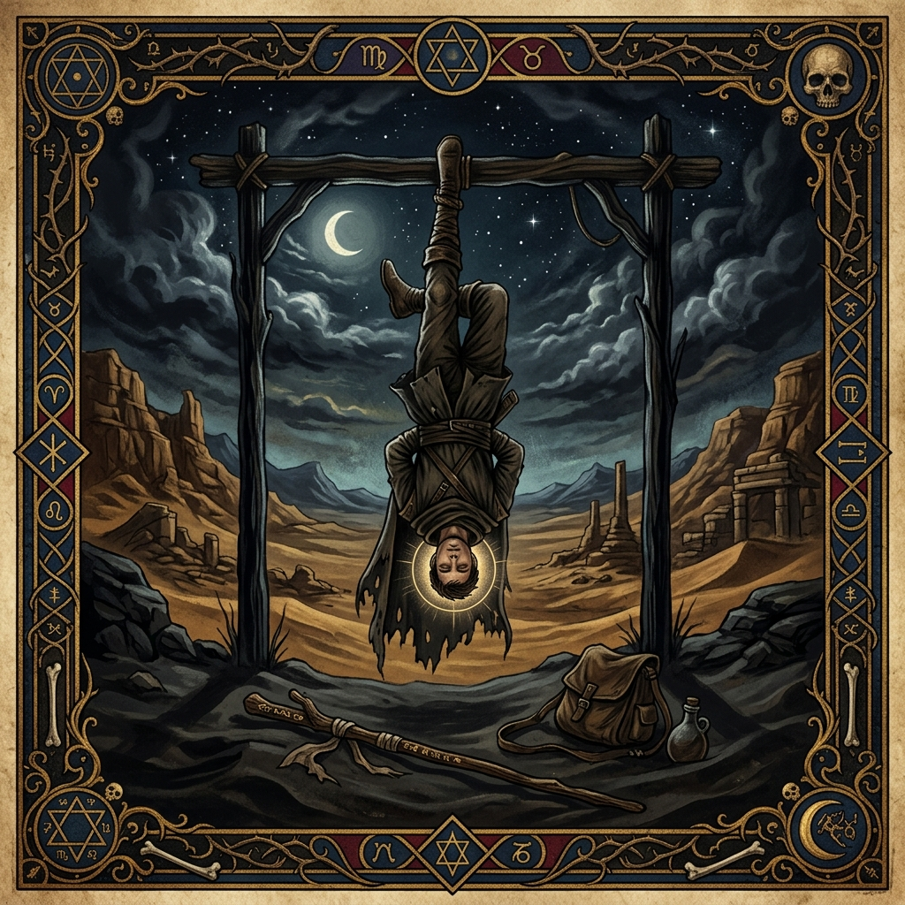

# Tarot Choice Paths

These checklists are derived from [ThreadsOfFate/src/data/storyData.js](ThreadsOfFate/src/data/storyData.js). For any non-fatal path, finish with Stage 7: "Reveal my destiny." Tarot images live in [ThreadsOfFate/public/tarot](ThreadsOfFate/public/tarot).

## tarot_alchemist.png (Perfect Destiny)

1. Stage 1: "Seek the gypsy woman in Tarifa and ask her to read the dream."
2. Stage 2: "Leave the shop and join a caravan across the Sahara toward the pyramids."
3. Stage 3: "Warn the chieftains of the attack, risking your life by trusting the omens."
4. Stage 4: "Commune with the Desert, the Wind, the Sun, and the Soul of the World to become the wind."
5. Stage 5: "Smile at the revelation; the treasure was where you began. You must return."
6. Stage 6: "Keep a small share for travel and return to Al-Fayoum to be with Fatima."
7. Stage 7: "Reveal my destiny."

## tarot_destiny.png (Destiny primary, with deviation)

1. Stage 1: "Seek the gypsy woman in Tarifa and ask her to read the dream."
2. Stage 2: "Leave the shop and join a caravan across the Sahara toward the pyramids."
3. Stage 3: "Warn the chieftains of the attack, risking your life by trusting the omens."
4. Stage 4: "Offer the chief all your gold and promise to lead his armies to victory."
5. Stage 5: "Smile at the revelation; the treasure was where you began. You must return."
6. Stage 6: "Build a library and sanctuary to teach the Language of the World."
7. Stage 7: "Reveal my destiny."

## tarot_ambition.png

1. Stage 1: "Ignore the dream and invest in more sheep to build a merchant's life."
2. Stage 2: "Use the profits to buy ships and expand into Mediterranean trade."
3. Stage 3: "Use the vision to leverage power and become the oasis ruler."
4. Stage 4: "Offer the chief all your gold and promise to lead his armies to victory."
5. Stage 5: "Vow revenge and hunt down the robbers for your stolen gold."
6. Stage 6: "Use the gold to buy the surrounding lands and become a lord in Andalusia."
7. Stage 7: "Reveal my destiny."

## tarot_wisdom.png (Wisdom primary, secondary not Destiny)

1. Stage 1: "Study old texts to interpret the dream as symbol rather than calling."
2. Stage 2: "Persuade the crystal merchant to travel to Mecca and fulfill his vow."
3. Stage 3: "Use the vision to leverage power and become the oasis ruler."
4. Stage 4: "Explain the impossibility of the task and appeal to the chief's reason."
5. Stage 5: "Vow revenge and hunt down the robbers for your stolen gold."
6. Stage 6: "Build a grand estate and shower your loved ones with luxury."
7. Stage 7: "Reveal my destiny."

## tarot_love.png (Love primary, not Love_Love)

1. Stage 1: "Ignore the dream and invest in more sheep to build a merchant's life."
2. Stage 2: "Partner with a local artisan to build a crystal empire, but keep the desert in your sights."
3. Stage 3: "Pledge yourself to Fatima, then continue the journey with her blessing."
4. Stage 4: "Offer the chief all your gold and promise to lead his armies to victory."
5. Stage 5: "Let love guide you; vow to return to Fatima after you secure the treasure."
6. Stage 6: "Build a library and sanctuary to teach the Language of the World."
7. Stage 7: "Reveal my destiny."

## tarot_fear.png (Fear primary, not Fear_Fear)

1. Stage 1: "Ignore the dream and invest in more sheep to build a merchant's life."
2. Stage 2: "Stay in Tangier a while longer to rebuild your confidence before crossing the desert."
3. Stage 3: "Leave the oasis with a smaller caravan, choosing caution while still moving forward."
4. Stage 4: "Offer the chief all your gold and promise to lead his armies to victory."
5. Stage 5: "Give in to despair and abandon the excavation, leaving the Pyramids behind."
6. Stage 6: "Build a library and sanctuary to teach the Language of the World."
7. Stage 7: "Reveal my destiny."

## tarot_sun.png (Love_Love)

1. Stage 1: "Seek the gypsy woman in Tarifa and ask her to read the dream."
2. Stage 2: "Partner with a local artisan to build a crystal empire, but keep the desert in your sights."
3. Stage 3: "Pledge yourself to Fatima, then continue the journey with her blessing."
4. Stage 4: "Commune with the Desert, the Wind, the Sun, and the Soul of the World to become the wind."
5. Stage 5: "Let love guide you; vow to return to Fatima after you secure the treasure."
6. Stage 6: "Build a grand estate and shower your loved ones with luxury."
7. Stage 7: "Reveal my destiny."

## tarot_moon.png (Fear_Fear)

1. Stage 1: "Seek the gypsy woman in Tarifa and ask her to read the dream."
2. Stage 2: "Stay in Tangier a while longer to rebuild your confidence before crossing the desert."
3. Stage 3: "Leave the oasis with a smaller caravan, choosing caution while still moving forward."
4. Stage 4: "Commune with the Desert, the Wind, the Sun, and the Soul of the World to become the wind."
5. Stage 5: "Give in to despair and abandon the excavation, leaving the Pyramids behind."
6. Stage 6: "Bury most of the gold again so no thieves ever target you."
7. Stage 7: "Reveal my destiny."

## tarot_hermit.png (Wisdom_Wisdom)

1. Stage 1: "Study old texts to interpret the dream as symbol rather than calling."
2. Stage 2: "Persuade the crystal merchant to travel to Mecca and fulfill his vow."
3. Stage 3: "Keep the vision secret and observe the war to study its strategies."
4. Stage 4: "Explain the impossibility of the task and appeal to the chief's reason."
5. Stage 5: "Realize the true treasure is the knowledge gained along the way."
6. Stage 6: "Build a library and sanctuary to teach the Language of the World."
7. Stage 7: "Reveal my destiny."

## tarot_star.png (Wisdom_Destiny)

1. Stage 1: "Study old texts to interpret the dream as symbol rather than calling."
2. Stage 2: "Leave the shop and join a caravan across the Sahara toward the pyramids."
3. Stage 3: "Keep the vision secret and observe the war to study its strategies."
4. Stage 4: "Commune with the Desert, the Wind, the Sun, and the Soul of the World to become the wind."
5. Stage 5: "Realize the true treasure is the knowledge gained along the way."
6. Stage 6: "Use the gold to buy the surrounding lands and become a lord in Andalusia."
7. Stage 7: "Reveal my destiny."

## tarot_lovers.png (Fatal)

1. Stage 1: "Stay with the merchant's daughter and settle into a quiet future."
Ends immediately.

## tarot_tower.png (Fatal)

1. Stage 1: "Avoid the church and the dream altogether, choosing safety over omens."
Ends immediately.

## tarot_hanged.png (Fatal)

1. Stage 1: "Seek the gypsy woman in Tarifa and ask her to read the dream."
2. Stage 2: "Leave the shop and join a caravan across the Sahara toward the pyramids."
3. Stage 3: "Warn the chieftains of the attack, risking your life by trusting the omens."
4. Stage 4: "Beg the Alchemist to use his power, admitting you know nothing."
Ends immediately.

## tarot_death.png (Fatal)

1. Stage 1: "Seek the gypsy woman in Tarifa and ask her to read the dream."
2. Stage 2: "Leave the shop and join a caravan across the Sahara toward the pyramids."
3. Stage 3: "Warn the chieftains of the attack, risking your life by trusting the omens."
4. Stage 4: "Surrender to death, finding peace in the memory of Fatima's smile."
Ends immediately.
